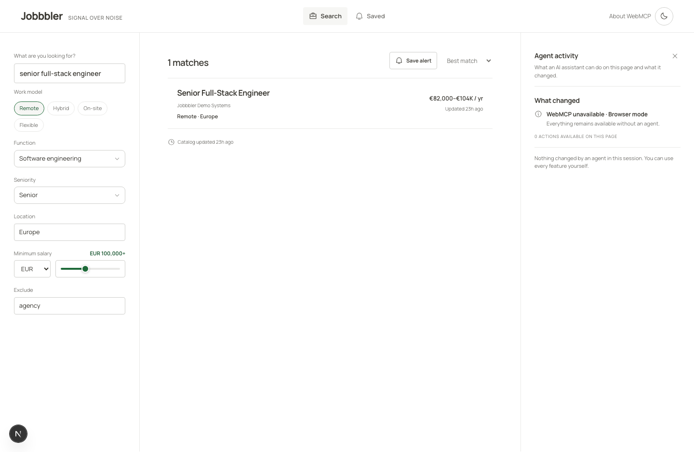
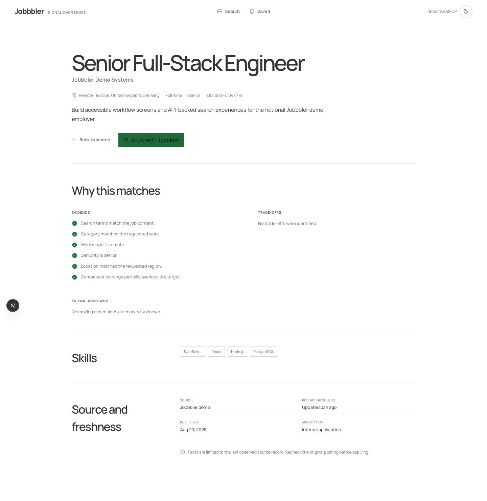
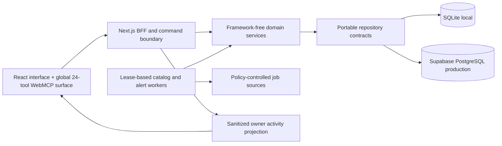

# Jobbbler

[](https://github.com/der-bear/jobbbler/actions/workflows/ci.yml)

**Find once. Stay updated. Apply with control.**

Job search is repetitive. People rerun the same queries every day, rebuild the
same filters, and still risk missing the one meaningful change — a new role, a
salary revision, a posting that quietly closed.

Jobbbler answers that with a plain, typography-first job portal for technology
roles: search, filters, saved alerts, and one deliberate application at a time.
Describe what you want once, in plain words, to a compatible browser agent; the
agent runs the search on the real site, the server keeps checking after you
close the page, and the next answer contains only what changed. When it is time
to apply, the flow deliberately slows down: the exact disclosure is shown, and
one explicit decision — bound to that exact application — is recorded before
anything is shared or submitted.

The technology that makes this possible is WebMCP — no separately installed or
declared MCP server. A global Agent layer is available on every page: the same
24 focused tools stay discoverable across navigation, while private and
workflow-specific actions enforce IDs, ownership, and state when executed.

> Not an AI job board. A proof that any data-rich website can become safely
> operable by an external browser agent — without a separate MCP server,
> without hiding what changed, and without confusing tool access with human
> authority.

Built for the OpenAI WebMCP Challenge.



## Why it is different

- **Explainable discovery.** Structured criteria, source provenance, freshness,
  salary semantics, what to verify, and fit evidence stay visible in the
  interface. Salary ranking is currency-aware (EUR, USD, GBP, and CAD at pinned
  rates) and explains itself with evidence strings.
- **Global agent layer.** Twenty-four focused tools for search, roles,
  comparison, saved alerts, and applications — all registered on every page,
  so navigation never costs an agent a capability. State-gated tools answer
  with a clear next step when
  their moment has not arrived, and the site describes itself — an agent can
  read accepted filter vocabulary instead of guessing enums and ask how a role
  accepts applications before starting one.
- **Observable agent work.** The Agent layer uses a clear **Activity**,
  **Tools**, **Guide** hierarchy. It shows readiness, the current tools, and
  human-readable activity without taking over the normal portal. Every activity
  entry leads with a human sentence, followed by the tool name, status, and
  duration. On mobile, an "Agent view" button opens the same layer. The
  normal UI remains usable if WebMCP is unavailable.
- **No-login first run.** No account required: an ephemeral private owner
  session lets someone start immediately. A verified email enables passwordless
  recovery of saved searches without turning the first visit into an account
  wall.
- **Independent authority layers.** Agent delegation, payload-bound data
  permission, immutable review, and single-use confirmation are separate
  server-enforced decisions. The agent presents each decision to the person in
  their external agent client, and the server accepts
  it only when it is bound to the exact server-issued request and draft
  version, recording the decision channel as evidence.
- **Truthful actions.** Internal fictional-demo applications can produce an
  immutable receipt after the exact request-bound decision. External roles open
  a validated HTTPS employer page; Jobbbler creates no draft, receipt, handoff
  record, or submitted claim for them.
- **Durable automation.** Saved searches keep being checked after you close the
  page: a worker with leases, deterministic change detection, delivery
  idempotency, bounded retries, and verified encrypted email endpoints.

## Product tour

| Find once                                                                                                                          | Stay updated                                                                            | Apply with control                                                                                                |
| ---------------------------------------------------------------------------------------------------------------------------------- | --------------------------------------------------------------------------------------- | ----------------------------------------------------------------------------------------------------------------- |
| Search and live filters — chips, multi-selects, and a minimum-salary selector — with every result opening as a readable role page. | Save the exact query, preview the timing, verify your email, and see only what changed. | Review one document-like draft, decide once on the exact disclosure, and the sealed payload submits exactly once. |
| Evidence, trade-offs, and source freshness stay on the role page.                                                                  | Pause or resume checking without exposing an address or credential to WebMCP.           | Agent-prepared answers keep their provenance and stay editable until the person's review.                         |



## WebMCP surface

Jobbbler uses `document.modelContext.registerTool` with feature detection,
strict JSON schemas, stable global registration with state-gated execution,
cancellation propagation, explicit annotations, and concise JSON-serializable
results. A browser capability is never treated as identity or authorization.

> Jobbbler does not only expose tools. It also teaches a visiting agent the
> safest useful path through them—without executing the plan or granting
> authority.

`plan_job_workflow` returns recommended safe steps for a goal from the current
page. It is advisory only: it plans, it never acts.

The catalog has **24 focused tools**, all registered on every page. Six are
clear entry points — `plan_job_workflow`, `get_search_filters`, `search_jobs`,
`open_job_details`, `prepare_application`, and `open_jobbbler_page`. The
remaining tools are grouped below by the product area they operate on and
validate explicit IDs, ownership, and workflow state at execution time:

- Search `/`: `get_search_state` (including an explicit truncation summary for
  bounded criteria)
- Role `/jobs/:jobId`: `get_job_details`, `get_job_application_capability`
  (how this role accepts applications — what the agent may prepare, what stays
  human, and whether the person must continue on the employer site),
  `compare_jobs`
- Comparison `/compare`: `get_comparison`, `add_job_to_comparison`,
  `remove_job_from_comparison`
- Saved `/saved`: `get_saved_alerts`, `set_job_alert_state`,
  `open_saved_search`, `get_latest_search_update` (reads only what changed
  since the last check, not the full result list)
- Application `/apply/:draftId`: seven outcome-oriented tools —
  `get_application_readiness`, `request_application_assistance`,
  `decide_application_assistance`, `propose_application_updates`,
  `request_submission_review`, `decide_application_submission`, and
  `withdraw_application_consent` — each answering with the next safe step when
  its stage has not arrived

Application tool results never expose an owner ID, candidate answer or contact
detail, reusable agent token, confirmation secret, email destination, or
ciphertext. Agent-supplied draft patches are accepted as bounded tool input,
then remain visible and editable in the private review.

See the [actual `registerTool` implementation](packages/webmcp/src/register.ts),
the [WebMCP capability matrix](docs/architecture/webmcp-capability-matrix.md),
and the [authorization and consent design](docs/architecture/agent-authorization-and-consent.md).

## Architecture



The monorepo keeps contracts, domains, storage adapters, connectors, WebMCP
lifecycle, workers, UI primitives, and the Next.js application independent.
SQLite and PostgreSQL implement the same behavioral repository contracts.
External network work is performed outside database transactions.

More detail: [architecture index](docs/architecture/README.md),
[source governance](docs/architecture/source-ingestion.md),
[realtime activity](docs/architecture/realtime-agent-activity.md), and
[SQLite-to-PostgreSQL migration runbook](docs/operations/postgres-cutover-and-rollback.md).

## Run locally

Requirements: Node.js 24 and pnpm 11.19.0.

```bash
cp .env.example .env
pnpm install --frozen-lockfile
pnpm db:seed
pnpm ingest -- --source all --limit 50
pnpm dev
```

Open the local URL printed by Next.js. Fixture ingestion is the default and
does not contact upstream providers. Live ingestion is always explicit
(`pnpm ingest:live`) and remains governed by the checked-in source policies.

SQLite is the zero-service development default. Set `DATABASE_URL` for
PostgreSQL/Supabase; the server selects the PostgreSQL adapter without
exposing that connection string to the browser. See
[.env.example](.env.example) for the complete runtime contract.

## Workers

```bash
# Run one deterministic catalog and alert cycle
JOBBBLER_WORKER_MODE=all_once pnpm dev:worker

# Run the recurring service
JOBBBLER_WORKER_MODE=all_service pnpm dev:worker
```

Local email delivery defaults to an explicit capture adapter. Production
delivery requires a configured provider, a verified owner endpoint, and
server-only encryption/provider keys.

## Verification

```bash
pnpm verify
```

The release gate covers formatting/lint, strict TypeScript, domain and storage
invariants, authorization races, connector policy, worker idempotency, API
bounds, WebMCP registration/lifecycle/output budgets, security headers, and
production builds. Browser QA evidence is recorded in
[design-qa.md](design-qa.md).

The current release candidate passes `pnpm verify`: 104 test files passed and
1 skipped, 476 tests passed and 29 skipped, and both production builds
completed. The PostgreSQL 16 contract passes 35/35, including concurrent
authorization and indexed location-discovery cases. The final published build
is smoke-tested again before submission.

## Security and privacy

- AES-256-GCM for recoverable email envelopes; HMAC/SHA-256 challenge and session-token hashes at rest
- HttpOnly, same-site, production-secure cookies
- Trusted-origin mutation checks and durable principal-scoped rate limits
- Streamed request-body byte caps and strict Zod validation
- Enumeration-resistant, single-use passwordless recovery that atomically revokes prior sessions
- Human-only, two-step private-data deletion with transactional storage-adapter parity
- Purpose/recipient/field/payload/notice-bound data grants
- Transactional compare-and-swap approval and single-use confirmation consumption
- Deny-by-default PostgreSQL RLS, production CSP/HSTS, structured redacted logs
- Untrusted source content never rendered as trusted HTML or treated as instructions

Please report vulnerabilities through the process in [SECURITY.md](SECURITY.md).

## License

[MIT](LICENSE) © 2026 Alex Derkach
