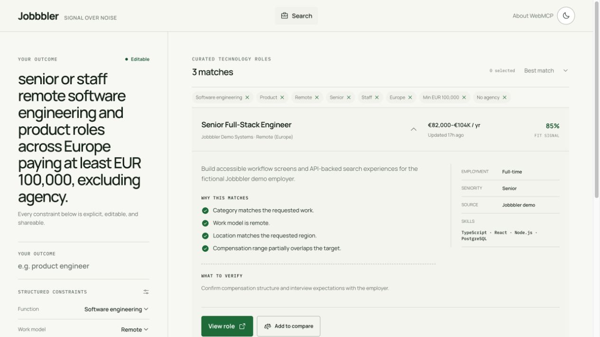
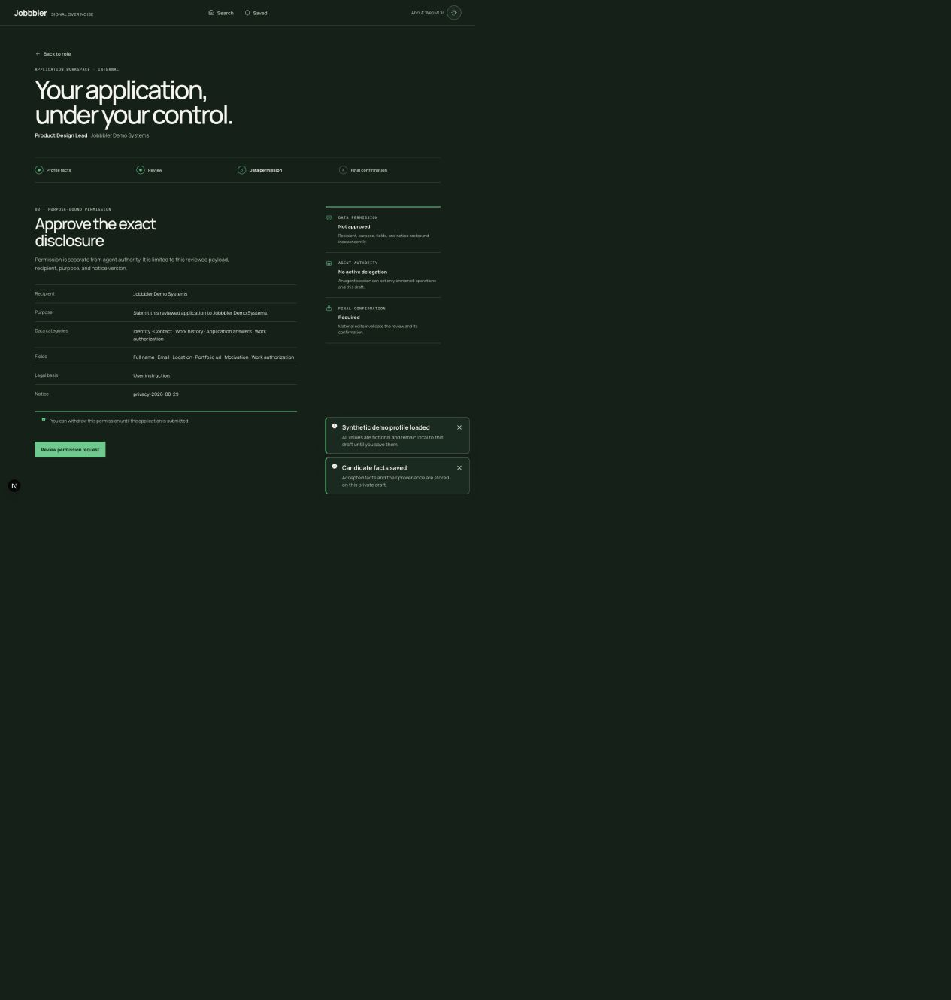

# Jobbbler

[](https://github.com/der-bear/jobbbler/actions/workflows/ci.yml)

**Signal over noise — with an agent you can see and authority you control.**

Jobbbler is an evidence-first workspace for discovering technology roles, comparing trade-offs, monitoring a search, and preparing one deliberate application. It is a proof of value for the agentic web: a complete conventional product that a compatible browser agent can understand immediately, without a separately installed or declared MCP server. Each route exposes only the tools that make sense for its current state.

Built for the OpenAI WebMCP Challenge.



## Why it is different

- **Explainable discovery.** Structured criteria, source provenance, freshness, salary semantics, known unknowns, and fit evidence stay visible in the interface.
- **Route-scoped WebMCP.** Search, comparison, saved-alert, and application screens register small, purpose-specific tool sets. Navigation and application state remove stale tools.
- **Observable agent work.** Every tool execution has a bounded, human-readable activity state. The normal UI remains usable if WebMCP is unavailable.
- **No-login first run.** An ephemeral private owner session lets someone start immediately. A verified email enables passwordless recovery without turning the first visit into an account wall.
- **Independent authority layers.** Agent delegation, request-bound data permission, immutable review, and final confirmation are separate server-enforced decisions. Agent-mediated approvals leave a versioned server receipt without pretending to cryptographically identify the human or agent vendor.
- **Truthful actions.** Internal fictional-demo applications produce an immutable receipt. External roles can only be handed off; Jobbbler never claims an external submission it cannot prove.
- **Durable automation.** Saved searches run in a worker with leases, deterministic deltas, delivery idempotency, bounded retries, and verified encrypted email endpoints.

## Product tour

| Discover and explain                                                 | Monitor privately                                                                               | Apply deliberately                                                                                                      |
| -------------------------------------------------------------------- | ----------------------------------------------------------------------------------------------- | ----------------------------------------------------------------------------------------------------------------------- |
| Compose a human-readable outcome and edit every inferred constraint. | Save the exact query, preview timing, verify a delivery endpoint, and inspect the latest delta. | Accept candidate facts, seal a review, approve the exact disclosure, and issue one five-minute single-use confirmation. |
| Compare up to three roles without losing provenance or unknowns.     | Pause, resume, or revoke without exposing an address or credential to WebMCP.                   | Agent suggestions remain visibly unaccepted until the human edits or approves them.                                     |



## WebMCP surface

Jobbbler uses `document.modelContext.registerTool` with feature detection, strict JSON schemas, route/state lifecycle cleanup, cancellation propagation, explicit annotations, and concise JSON-serializable results. A browser capability is never treated as identity or authorization.

Representative tool sets:

- Search: `search_jobs`, `get_search_state`
- Role detail: `get_job_details`, `compare_jobs`
- Comparison: `get_comparison`, `remove_compared_job`
- Saved: `get_saved_alerts`, `set_job_alert_state`
- Application: a state-dependent subset of safe state, scoped-access, answer, validation, review, consent-request, confirmation-focus, and single-application submission tools

The application flow never exposes an owner ID, candidate answer, reusable agent token, confirmation secret, email destination, or ciphertext in tool input/output.

See the [WebMCP capability matrix](docs/architecture/webmcp-capability-matrix.md) and [authorization and consent design](docs/architecture/agent-authorization-and-consent.md).

## Architecture


The monorepo keeps contracts, domains, storage adapters, connectors, WebMCP lifecycle, workers, UI primitives, and the Next.js application independent. SQLite and PostgreSQL implement the same behavioral repository contracts. External network work is performed outside database transactions.

More detail: [architecture index](docs/architecture/README.md), [source governance](docs/architecture/source-ingestion.md), [realtime activity](docs/architecture/realtime-agent-activity.md), and [SQLite-to-PostgreSQL migration runbook](docs/operations/postgres-cutover-and-rollback.md).

## Run locally

Requirements: Node.js 24 and pnpm 11.19.0.

```bash
cp .env.example .env
pnpm install --frozen-lockfile
pnpm db:seed
pnpm ingest -- --source all --limit 50
pnpm dev
```

Open the local URL printed by Next.js. Fixture ingestion is the default and does not contact upstream providers. Live ingestion is always explicit (`pnpm ingest:live`) and remains governed by the checked-in source policies.

SQLite is the zero-service development default. Set `DATABASE_URL` for PostgreSQL/Supabase; the server selects the PostgreSQL adapter without exposing that connection string to the browser. See [.env.example](.env.example) for the complete runtime contract.

## Workers

```bash
# Run one deterministic catalog and alert cycle
JOBBBLER_WORKER_MODE=all_once pnpm dev:worker

# Run the recurring service
JOBBBLER_WORKER_MODE=all_service pnpm dev:worker
```

Local email delivery defaults to an explicit capture adapter. Production delivery requires a configured provider, a verified owner endpoint, and server-only encryption/provider keys.

## Verification

```bash
pnpm verify
```

The release gate covers formatting/lint, strict TypeScript, domain and storage invariants, authorization races, connector policy, worker idempotency, API bounds, WebMCP registration/lifecycle/output budgets, security headers, and production builds. Browser QA evidence is recorded in [design-qa.md](design-qa.md).

## Security and privacy

- AES-256-GCM for recoverable email envelopes; HMAC/SHA-256 challenge and session-token hashes at rest
- HttpOnly, same-site, production-secure cookies
- Trusted-origin mutation checks and durable principal-scoped rate limits
- Streamed request-body byte caps and strict Zod validation
- Enumeration-resistant, single-use passwordless recovery that atomically revokes prior sessions
- Human-only, two-step private-data deletion with transactional storage-adapter parity
- Purpose/recipient/field/payload/notice-bound data grants
- Transactional compare-and-swap approval and single-use confirmation consumption
- Deny-by-default PostgreSQL RLS, production CSP/HSTS, structured redacted logs
- Untrusted source content never rendered as trusted HTML or treated as instructions

Please report vulnerabilities through the process in [SECURITY.md](SECURITY.md).

## License

[MIT](LICENSE) © 2026 Alex Derkach
